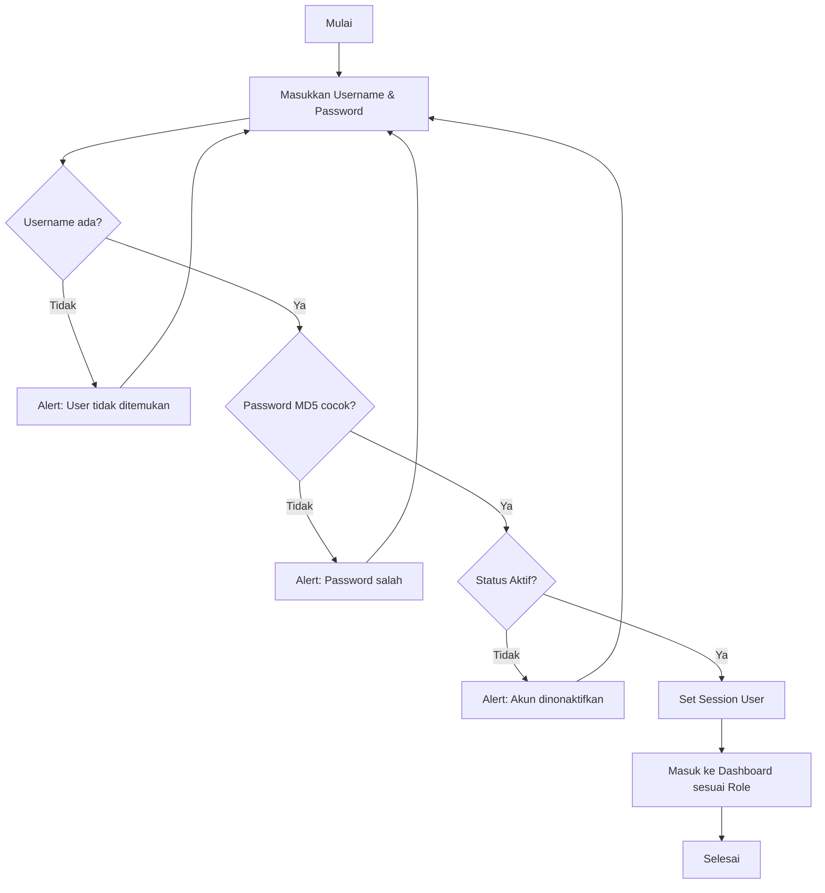
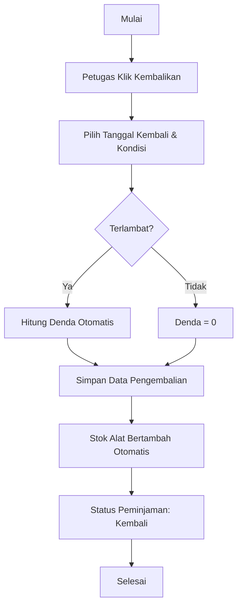

# DOKUMENTASI SISTEM PEMINJAMAN ALAT

## 1. Flowchart Login


## 2. Flowchart Peminjaman
```mermaid
graph TD
    A[Mulai] --> B[Peminjam Cari Alat]
    B --> C[Klik Pinjam & Isi Form]
    C --> D[Kirim Pengajuan (Status: Menunggu)]
    D --> E[Petugas/Admin cek Data Peminjaman]
    E --> F{Setujui?}
    F -- Tidak --> G[Status: Ditolak]
    F -- Ya --> H[Status: Disetujui]
    H --> I[Stok Alat Berkurang Otomatis]
    G --> J[Selesai]
    I --> J
```

## 3. Flowchart Pengembalian


## 4. Entity Relationship Diagram (ERD) - Ringkasan
- **Users** (1) ---- (N) **Peminjaman**
- **Users** (1) ---- (N) **Log Aktivitas**
- **Kategori** (1) ---- (N) **Alat**
- **Alat** (1) ---- (N) **Detail Peminjaman**
- **Peminjaman** (1) ---- (1) **Detail Peminjaman**
- **Peminjaman** (1) ---- (1) **Pengembalian**
